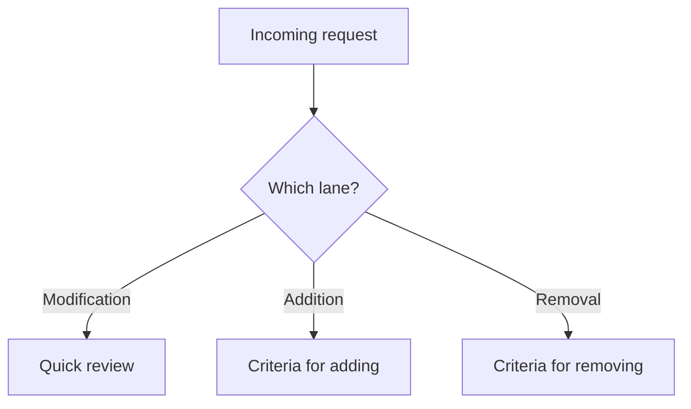

Every component enters the system through a decision and should leave through one too. This page owns those decisions: how to sort a request, what a new component has to clear to get in, and when an existing one should go. [Release management](/ds101/release-management/) covers the mechanics of shipping and retiring it. [Decision governance](/ds101/decision-governance/) covers how the decision gets owned and recorded.

:::tip[Key takeaways]
- **Sort each request into a lane first.** Otherwise a new component gets reviewed like a quick bug fix, or the reverse.
- **Add a component only when 3+ teams need it.** Without a bar, the system grows by inertia instead of intent.
- **Remove components on clear triggers.** A system with no way to remove things only grows until it collapses.
:::

## The problem

The design-system-ops governance notes ([`knowledge-notes/component-governance.md`](https://github.com/murphytrueman/design-system-ops/blob/main/knowledge-notes/component-governance.md)) warn that without deliberate decisions, "a design system accumulates components by inertia rather than by intent." A system with no way to remove things only grows, until it collapses under its own weight.

## Practices

### Sort each request into a lane first

Inayaili de León Persson's **Canonical** Vanilla Framework sorts every incoming change into one of three lanes before anything else happens (Brad Frost, *Atomic Design*, Chapter 5):

- **Modification**: feature additions, bug fixes, visual tweaks, or performance work on something that exists.
- **Addition**: a new pattern filling a gap, with explicit safeguards against bloat.
- **Removal**: deprecation shipped with advance notice, not a surprise.

Sorting first keeps a "should we add a new component" conversation from being argued like a five-minute bug-fix review, or the reverse. Additions and removals then go through the criteria below.

### Criteria for adding a component

Ask these in order. A proposal that fails an early question doesn't need a debate about the later ones.

1. **Is it actually new?** A new visual expression of something that exists, like a new button color, is usually a variant of the existing component, not a new one ([API Design](/ds101/api-design/)).
2. **Do three or more teams need it now?** Dan Mall's threshold from [Pilot strategy](/ds101/pilot-strategy/): if three or more teams need it *right now*, it goes in. If only one team does, that team solves it on its own for now. This matches software's **rule of three**, from Martin Fowler's *Refactoring* (1999), credited there to Don Roberts. A pattern earns a shared abstraction the third time it shows up, once there's real evidence of the shape it needs.
3. **Is it the same user problem each time?** [Cathy Dutton](https://alistapart.com/article/problem-with-patterns/) warns that reuse is usually measured from the organization's side, not the user's. A date picker shared by leisure travel booking and urgent medical scheduling looks identical, but one user is comparing options and the other needs the first available slot. State the user's goal without describing the interface. "Three teams want a date picker" fails. "Three teams need to help someone book the earliest slot" passes.
4. **Does it clear the quality bar?** It meets accessibility standards before shipping, not after. It's complete: states, responsive behavior, content guidance, and docs, not just the happy path. And it's worth the maintenance cost, since the system team carries it forever. The [design-to-code contract](/ds101/design-to-code-contract/) spells out what "complete" means at each stage.

The old refactoring rule applies here too: "Three strikes and you refactor," attributed to Don Roberts in Martin Fowler's *Refactoring* (1999).

### Criteria for removing a component

Deprecate a component when any of these is true:

- a better alternative exists with a clear migration path
- usage is at or near zero
- accessibility debt can't be fixed
- maintenance cost outweighs its value
- it no longer fits the system's direction

Every deprecation needs a timeline and a migration path, not just a warning. **IBM's** Carbon is the standard reference for bundling deprecations with detailed migration guides. [Release management](/ds101/release-management/) covers the deprecate → migrate → remove sequence.

## Common mistakes

- **Deprecating a component without tracing its usage first.** Murphy Trueman warns that a component's riskiest users are often the invisible ones: low-priority internal tools nobody thinks to check. See [System Takeover](/ds101/system-takeover/) and [Dependency observability](/ds101/dependency-observability/) for how to find them, and [System inventory](/ds101/system-inventory/) for which system components render it.
