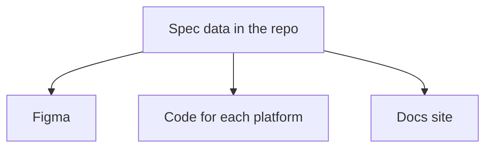

A component spec records what a component must be: its parts, its props, the tokens it uses, and the behavior a picture can't show. Decide which tool holds that record before anyone builds, and write it precisely enough that a team who never met the designer can build from it.

:::tip[Key takeaways]
- **Choose where the spec lives before building.** Without one home, Figma, code, and docs each hold part of it and quietly disagree.
- **Record what the design can't show.** Tools guess roles and unsupported prop combinations, and generated code gets them wrong.
- **Reference tokens, never raw values.** A spec holding a hex code looks right today and misses the next rebrand.
:::

## The problem

A spec used to be a note from a designer to the developer sitting next to them. That stops working once a system ships to several codebases. [Nathan Curtis](https://medium.com/eightshapes-llc/component-specifications-1492ca4c94c) notes that "a three platform setup (iOS, Android, and web) is common, and some systems like IBM Carbon spread across many more." One design decision now has to reach teams who never sit in the same standup.

Each of those teams fills the gaps in a design file differently. One guesses a spacing value, another invents a prop name. Nobody decides that the disabled button looks different on iOS than on Android. It just does, and nobody notices until a user switches platforms.

Code generation makes the gaps more costly. Before Curtis's spec tool recorded each part's role, it turned three look-alike pills (a plain one, a checkbox, and a toggle button) into the same `div` with ARIA attributes (the HTML attributes screen readers announce) added on top, because nothing in the file told them apart. [Component accessibility](/ds101/component-accessibility/#record-each-parts-role-in-the-spec) tells the full story. A developer reading the file might have asked which pill was which. The generator didn't.

## Choosing where the spec lives

Figma, the code, and the docs site each hold part of a component's truth, and they routinely disagree. [Shane P Williams](https://designsystemscollective.substack.com/p/the-job-nobody-is-hiring-for-yet) says "none of the three is lying. They are each authoritative for a different question": Figma for what was intended, Storybook for what was built and documented, production for what shipped. A spec answers the first question, and it has to be finished before build. The [design contract](/ds101/design-to-code-contract/#design-contract) is met only when "the spec can be built without clarifying questions." So the test is which tool lets your team write the full intent early, and generate the other outputs from it. Someone still has to keep the layers in agreement afterward. [Governance for AI](/ds101/governance-for-ai/#name-a-referee-for-competing-sources-of-truth) covers that role.

### Author in Figma and extract the data

Designers keep working where they already work, and a tool turns the file into data. Curtis's `specs-cli` reads a Figma library and writes one compact spec per component into the repo, with anatomy, props, styles, token references, and variants. Coding agents then read those files, not Figma ([Figma access for agents](/ds101/figma-access-for-agents/#a-spec-cli-that-writes-files)). This fits design-led teams with a large library already built carefully in Figma.

The cost is that Figma has no field for much of a spec, so it gets squeezed into whatever Figma does have. Roles go into Dev Mode annotations. Code-only props go into nested instances on a layer named "Code only props". Code keys come from layer names, which lose separators, casing, and punctuation on the way ([Component property naming](/ds101/component-property-naming/#name-layers-identically-in-every-variant)). Even Curtis's own team doesn't stop at Figma. His designers mark a component `READY_FOR_DEV`, then "conduct an agentic pass to compose the behaviors and accessibility Figma can't."

### Author the spec as data in the repo

The spec is a YAML or JSON file next to the code. Figma, each platform's code, and the docs pages are all generated from it. This is the direction of Curtis's ["Components as Data"](https://medium.com/@nathanacurtis/components-as-data-2be178777f21), where Figma becomes one output of the data alongside generated code. Murphy Trueman's toolkit keeps a similar metadata file per component, including the prop combinations the system blocks, which Trueman calls prohibited combinations ([Component API design](/ds101/component-api-design/#support-only-the-prop-combinations-you-document)).

<div class="mermaid-wrap">



</div>

A docs site built with Astro or Storybook can then render the spec rather than restate it. [Romina Kavcic](https://learn.thedesignsystem.guide/p/gamechanger-automatically-sync-design) applies the same rule to tokens: people browse and discuss them in a synced view but never edit values there. "Stop manually copying token values from your repo to documentation." Diana Wolosin's team at Indeed authors component docs in MDX and converts them to JSON for agents ([CI for agentic workflows](/ds101/ci-for-agentic-workflows/#feed-the-pipeline-structured-metadata)). That's the docs-first version of the same idea. No source here yet describes a full spec, roles and anatomy included, written directly in a docs site, so treat that variant as an open question.

This fits multi-platform systems where no single tool should own the definition. The cost is building the scripts that generate each output. Designers also need a way to edit the spec without opening a YAML file.

### Derive the spec from code

Storybook 10.3 generates a Component Manifest that lists components, props, stories, and docs, and an MCP (Model Context Protocol, the standard way agents read data from other tools) add-on lets agents query it ([Trueman](https://blog.murphytrueman.com/your-design-system-is-fragmenting-into-agent-files/)). It costs almost nothing to set up, and it always matches what was built. It fits a code-first team with no separate design source, or works as a check against the other two options.

The cost is that it describes what exists, not what was intended. It can't be the spec for a component nobody has built yet. It also leaves out composition, tokens, and status until someone adds them ([AI readiness](/ds101/ai-readiness/#publish-a-machine-readable-component-manifest)).

## Practices

### Write the spec so nobody has to ask

[Curtis](https://medium.com/eightshapes-llc/component-specifications-1492ca4c94c) argues that spec quality has to rise as a system grows past one platform. A spec is no longer a note for one team. It has to state intent precisely enough that teams who never talk to each other still build the same thing. In practice, that means the anatomy (named parts and how they nest), every prop with its type, options, and default, every state, and the tokens each part uses. Designers and developers should agree on the anatomy and props together before build, as [Component property naming](/ds101/component-property-naming/#agree-on-the-api-before-anyone-builds) describes. The [EightShapes Specs plugin](https://nathanacurtis.substack.com/p/the-eightshapes-specs-figma-plugin-2892f21adc96) exists because listing all of this by hand stops scaling once a spec serves three or more teams.

### Record what the design can't show

Some facts aren't visible in any design file, so readers and tools fill them in by guessing. Whichever option you chose above, give these facts a field in the spec.

The first is each part's role and action. "The role is an authored fact that must be carried in the spec," [Curtis](https://github.com/DirectedEdges/specs/blob/main/adr/067-anatomy-element-roles.md) concludes, and he keeps what a part *is* separate from what activating it *does* ([Component accessibility](/ds101/component-accessibility/#record-each-parts-role-in-the-spec)). The second is which prop combinations the system supports. Supernova warns that "if your system permits a certain usage, it will likely be used that way somewhere in the product" ([Component API design](/ds101/component-api-design/#support-only-the-prop-combinations-you-document)). The third is code-only props like `id` and `ariaLabel`, which change nothing on screen ([Component property naming](/ds101/component-property-naming/#sort-every-prop-into-figma-code-or-both)).

### Reference tokens, never raw values

A token reference carries meaning that a value doesn't. Curtis's example in ["Components as Data"](https://medium.com/@nathanacurtis/components-as-data-2be178777f21) is a raw color in a variant where a token was required. You can't see that error in a rendered mockup, but it's obvious in the data. The same loss shows up when a spec goes back into Figma. First on [Curtis's list](https://nathanacurtis.substack.com/p/what-component-specs-leave-behind) of what specs leave behind is "emitting a hex code when a color token is bound." The component looks right today and misses the next rebrand. Rendering the spec back is how you find these losses. [Figma access for agents](/ds101/figma-access-for-agents/#prove-the-round-trip-before-trusting-an-import) covers that round trip.

### Validate the spec against a schema

Structured data only pays off if something checks it against a schema: a machine-readable list of the fields a spec may have and the values each one allows. Curtis draws the line in ["Component Contracts and Schemas"](https://nathanacurtis.substack.com/p/component-contracts-and-schemas): "a description informs. A contract arbitrates." His smallest example is a single prop:

```yaml title="Contract excerpt"
props:
  size:
    type: string
    enum:
      - small
      - medium
      - large
    default: medium
```

The `enum` (a fixed list of allowed values) "reduces any possible size to three legal choices." In a loose document, "every value is just text, and text accepts anything," so `size: med` slips through. Against the schema, it fails.

### Keep one spec for every platform

Write the spec once, neutrally, and let each platform build its own native version from it. Specs maintained by hand for each platform drift apart the same way parallel implementations do. Platforms will still differ. Values that differ, like San Francisco on iOS and Roboto on Android, belong in tokens. Structure that differs, like a confirmation that's a dialog on iOS and a bottom sheet on Android, belongs in the spec as a recorded decision. [Platform divergence](/ds101/platform-divergence/) owns that split.

## Common mistakes

- **Calling the Storybook page the spec.** In Williams's split, Storybook answers what was built, not what was intended. If the build drifted from the intent, the drift now looks like the intent, and nothing is left to check it against.
- **Hoping layer names will carry behavior.** In Curtis's test library, no layer structure or naming pattern told a checkbox pill from a toggle button. A naming convention can't hold a role.
- **Assuming Figma annotations reach code.** A role annotated in Dev Mode only reaches code if code is generated from the spec, as Curtis's tool does. A developer building by hand may never open the annotation.
- **Expecting a lossless round trip.** Curtis found intent that specs can't carry yet, like the order of props in Figma's panel. His advice is to keep rendering until you know "what you are missing, and how much you value it."
- **Confusing multi-platform with cross-platform.** The goal isn't one implementation forced to look the same everywhere. It's one set of decisions, expressed natively on each platform.
