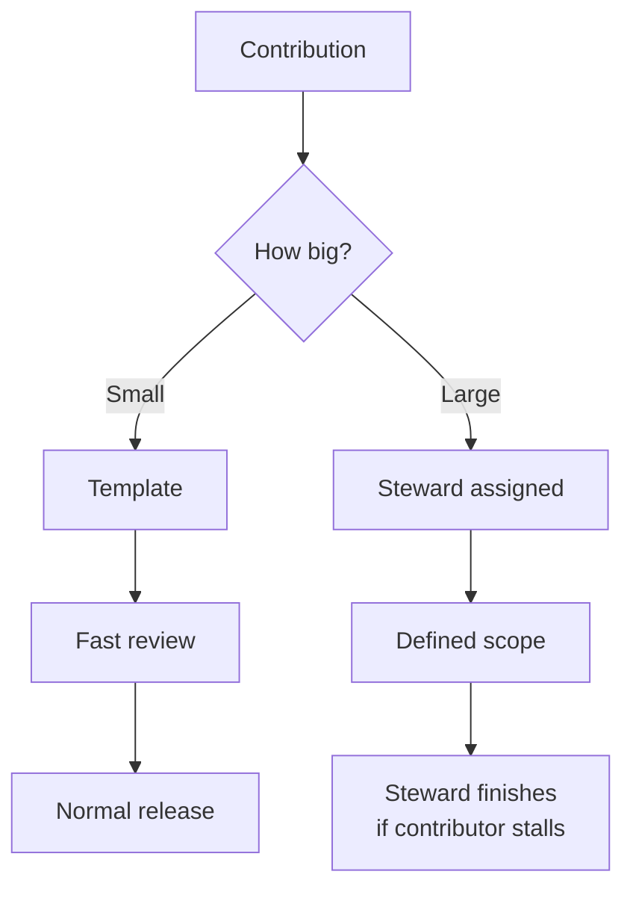

A contribution model decides how people outside the system team propose, build, and ship changes to the system. It sits between two neighbors. [Team models](/ds101/team-models/) decide who owns the system. [Component lifecycle](/ds101/component-lifecycle/) decides what a contribution has to clear to get in. [Fostering contribution](/ds101/fostering-contribution/) covers the culture that makes people show up at all.

:::tip[Key takeaways]
- **Fit the process to your org's problem.** A process built for the wrong problem ends up as a pipeline nobody uses.
- **Match the workflow to the contribution's size.** One process for everything slows small fixes down and lets big ones stall halfway.
- **Plan for a small group of contributors.** Opening the door to everyone rarely brings in more than a handful of people.
:::

## The problem

> "You can't define contribution until you truly understand what problem it's solving in your organisation."
>
> — [Ness Grixti, "Rethinking Contribution"](https://nessgrixti.com/articles/rethinking-contribution-lessons-from-the-messy-middle-of-design-systems/)

A process designed without that answer either builds a formal pipeline for contributors who don't exist, or leaves an open door with a README that nobody walks through.

## Practices

### Fit the process to your org's problem

At 80+ teams, Grixti says the problem is visibility: the system team can't see what every team needs. A lightweight feature-request process fits better than a pipeline that expects outside teams to ship finished work. At small scale, the better move is to teach product designers and engineers systems thinking, so they can extend the system themselves, instead of building a process for a volume of contributors that doesn't exist yet.

### Count contributions, not participation

[Curtis](https://medium.com/eightshapes-llc/defining-design-system-contributions-eb48e00e8898) defines a contribution as a proposal, design, code, doc, or asset, made by someone outside the system team and released through the system for others to reuse. Attending office hours or filing a bug is participation. That's valuable, but it isn't a contribution. Blur the two, and the process has to cover an endless surface and never ships.

### Match the workflow to the contribution's size

An icon, a missing variant, or a token fix should be close to self-serve: a clear template, fast review, and shipping in a normal release. A new component or a data-heavy pattern needs a steward, a defined scope, and the expectation that the contributor won't finish it alone. [Curtis](https://medium.com/eightshapes-llc/defining-design-system-contributions-eb48e00e8898) describes the steward's job: guide the contributor through the steps and pick up the rest if they stall. [Operating cadence](/ds101/operating-cadence/) covers the steward role in more depth.

### Publish what you want built

The **GOV.UK** Design System runs a public community backlog on GitHub. Anyone in UK government can propose a component. A working group checks that it's useful and not a duplicate, and a named community designer runs weekly catch-ups with the contributor. [Chris Ballantine-Thomas](https://designnotes.blog.gov.uk/2023/05/31/iterating-the-gov-uk-design-system-contribution-model/) describes their key fix: publish what the team wants built *before* anyone proposes it, instead of waiting for proposals that didn't match what the community needed. Contributor effort then lands on something the system needs. The full story is in [Governance case studies](/ds101/governance-case-studies/).

### Expect a small group of contributors

In zeroheight's *Design Systems Report 2026*, 69% of teams say anyone on the product team can contribute. But 82% actually get contributions from ten or fewer designers. Company size doesn't change this: even at companies with 5,000+ employees, only 37% have more than ten contributing designers. Plan for a small, well-supported champions network, not an open door with a README. [Fostering contribution](/ds101/fostering-contribution/) covers how to build one.

## Common mistakes

- **Pitching open contribution to leadership as extra capacity.** Contribution volume stays small whatever the org's size. In the short term, reviewing a contribution usually costs the system team more than building the thing itself. The real reasons to run a contribution model are legitimacy, spreading knowledge, and surfacing requirements the system team would never see.
