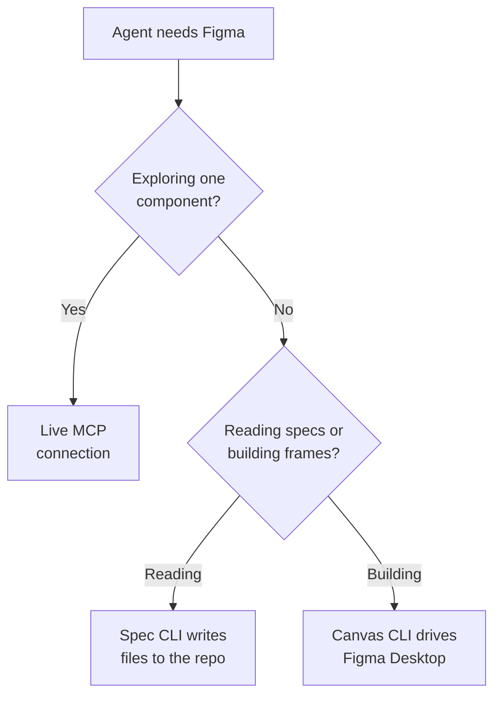

An MCP connection (Model Context Protocol, the standard way agents read data from other
tools) isn't the only way an agent can reach Figma. A newer approach uses a
**CLI** (command-line interface: a program run by typing short commands, which agents
can do as easily as people). The CLI does the mechanical work, like reading a component
library or checking a file, without a model. The agent only gets the compact result.
Use MCP when you're exploring, and a CLI when the answer is already in the data.

:::tip[Key takeaways]
- Pick the access route by the job: exploring, extracting specs, or building on the canvas
- Extract specs once with a script and commit them, so agents read files instead of Figma
- Keep AI downstream of extraction, where judgment is actually needed
- Check an agent's Figma edits with scripted checks before trusting them
:::

## The problem

The usual route today is a live connection. An agent opens the file through the
[Figma MCP server](/ds101/scaling-ai-effort-to-risk/), reads what it needs, and writes
code. That works for one component at a time. It breaks down when you want a whole
library turned into code, or kept in sync with it.
[Nathan Curtis](https://nathanacurtis.substack.com/p/figma-component-specs-on-command)
names the cost:

> "MCP fetches and processes vast payloads every time, throwing countless tokens to take
> it through its paces. Nothing persists. The work is disposable."
>
> — [Nathan Curtis, "Figma Component Specs on Command"](https://nathanacurtis.substack.com/p/figma-component-specs-on-command)

That data is mostly noise, too. In his button example, Figma returns 26,901
properties when about 350 matter, and 45 full variant copies when what matters is 15
differences between them. Every conversation pays to read all of that again, and the
reading is spread across a daily limit: the
[Figma MCP server's read limits](/ds101/tooling/) run from 200 to 600 calls a day on a
paid seat.

## Choosing an access route

Start with what the agent has to do. Curtis separates two kinds of design-system
decisions. The hard kind, like which components belong in the library, needs judgment.
The other kind, like extracting a button's anatomy from 45 variants, "has no ambiguity
at all. It's mechanical, known, deterministic." His rule for the second kind: "Never
rely on a predictive model when you can count something directly."

<div class="mermaid-wrap">



</div>

### A live MCP connection

An engineer assigned one component opens a connection, looks around, learns the
structure, and writes code. Curtis doesn't dismiss it: "MCP is genuinely useful and fits
this workflow well. It's human-paced exploration now with an AI turboboost." It fits
open questions and one-off tasks. The cost is that each session reads the full file data
again, results vanish when the chat ends, and reads count against the seat's limits.

### A spec CLI that writes files

Curtis built `specs-cli` for the extraction step. It reads a Figma library through the
REST API and writes one compact spec per component into your repo, with anatomy, props,
styles, token references, and variants stored as differences. The button above goes
from 1.38 MB of raw JSON to a 10 KB spec in about a second, 134 times smaller. Coding
agents then read the spec files, not Figma.

It fits a team generating or maintaining many components from Figma. Curtis says design
systems "of enterprise scale" use it as their main Figma-to-code input. For a handful of
components, the setup may not pay off. The cost is a one-time setup (a config file, a
Figma personal access token, and a scan of the library), plus Figma's REST API
[plan and seat limits](/ds101/tooling/). It covers components only, not layouts or
pages yet.

### A CLI that drives the canvas

[Sil Bormüller's `figma-cli`](https://github.com/silships/figma-cli/blob/main/README.md)
works in the other direction: an agent in Claude Code or Cursor builds frames,
components, and variables in Figma. It connects to the desktop app on your machine
rather than to Figma's cloud API, so it needs no API token and has no rate limit. It
also exports to the coded side (JSX, Storybook stories, CSS variables, DTCG token JSON)
and imports tokens from the files your project already has.

Bormüller measured the token difference himself, in one session: about 140 tokens from
a fresh session to a first component, against about 1,600 through an API-based MCP. It
fits teams who build in Figma with agents a lot, or who hit the MCP read limits. The
cost is how it connects. The default mode patches the desktop app, which some IT
policies won't allow. It also needs the desktop app open and a local Node.js install.

## Practices

### Extract specs once, then let agents read files

A spec that lives in the repo is loaded once, versioned, and shared by every agent that
needs it. That's the [minimal context principle](/ds101/context-engineering/) applied
to Figma data. Curtis's refresh is two commands after the one-time setup, run "in less
than a minute" for a whole library. These are the commands his post lists:

```bash
npm install -g @directededges/specs-cli
specs init
specs fetch
specs scan
specs generate
```

After the first run, only `fetch` and `generate` repeat. Because the output is the same
every time for the same input, a Git diff shows exactly what changed in Figma. Curtis
suggests running it "every week, day or hour using a Github action." The diff becomes
the agent's task list: "As components change, the work is knowing what's different and
changing just that."

### Keep AI downstream of the extraction

The script needs no model. Curtis: "At most, running your commands, although you can do
this without AI and use zero tokens. AI belongs in this pipeline: *downstream*." The
model's work starts from the spec: "Coding agents take a spec and generate types,
structure, styling, behaviors, and accessibility in parallel, governed by rules and
skills. Humans review this at gates rather than doing discovery themselves."
[CI for agentic workflows](/ds101/ci-for-agentic-workflows/) covers how to set those
gates.

### Check the canvas without a model

When an agent edits a Figma file, check the result the way you'd test code. `figma-cli`
ships three commands for this that don't use AI: `snapshot` records the file, `rules
gen` writes a contract per component, and `check` compares the open file against both.
Bormüller notes that check "exits non-zero and speaks `--json`, so it runs in CI" (the automated checks that
run on every change). He
verified it against GitHub's Primer, where a one-character typo in a single variant name
was caught in under a second.

### Clear the connection method with IT first

Both CLIs reach further than a browser tab does, and whoever approves tools should know
how. `specs-cli` needs a Figma personal access token stored in a local `.env` file.
`figma-cli` has three connection modes. The default "Yolo" mode patches one string in
the Figma Desktop app. Browser mode runs Figma in a Chromium browser instead, and Safe
mode goes through a Figma plugin. Neither of those two modifies the app. Bormüller's
[SECURITY.md](https://github.com/silships/figma-cli/blob/main/SECURITY.md) spells out
what each mode touches. He calls it "the page to hand to whoever approves tools at your
company."

## Common mistakes

- **Reading one tool's token numbers as a benchmark.** Bormüller's figures are his own,
  measured "like-for-like in one session," and approximate (tokens estimated from
  bytes). Test on your own tasks before you switch, the way Diana Wolosin
  [benchmarked MCP formats](/ds101/context-engineering/) against real prompts.
- **Expecting the spec to cover behavior.** Curtis calls Figma's data model "stable,
  incomplete and evolving slowly." Behavior, motion, and accessibility still need their
  own specs. See [Multi-platform component specs](/ds101/multi-platform-component-specs/).
- **Treating a failed check as a mistake.** In Bormüller's words, "Red means *changed*,
  not *wrong*." If the change was intended, take a new snapshot and review the diff, as
  you would with a snapshot test in code.
- **Dropping MCP entirely.** Curtis's case is against using a live connection for
  mechanical extraction, not against MCP. Open-ended questions about one component
  still suit a live connection.
