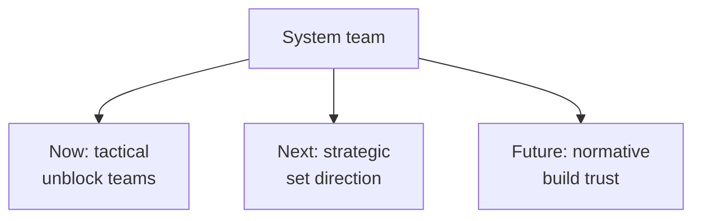

> "Design systems don't fail because of components. They fail because they lose alignment with the organisation."
>
> — [Marianne Ashton-Booth, "From Silos to Systems"](https://marianneashtonbooth.com), UXDX Berlin 2026

At scale, a design system is a small organization inside a bigger one, and it has to stay legible to, and connected with, everything around it. Staying aligned takes a toolkit, not one framework: a way to map who your stakeholders are, and others to match altitude, timing, and pitch to each group. This whole page draws on Ashton-Booth's talk.

:::tip[Key takeaways]
- **Answer at each group's altitude.** A list of shipped components doesn't land with someone asking about impact.
- **Run all three horizons at once.** Only short-term work means constant firefighting, and only long-term work means a mission statement with no delivery.
- **Revisit the mapping every planning cycle.** A map made at launch goes stale as the organization changes.
:::

## The problem

ITVX's Mosaic design system shows the scale problem. What started in 2015 as ITV Hub grew into ITVX by 2022, and the design system's operating model grew with it. A central core of 3 people (1 head of design systems and 2 designers) now works with 14 cross-functional partners (2 tech managers, 7 engineers, 7 designers). Together they feed 13 product workstreams across 2 product pillars, supporting 6 platforms and about 15,000 devices (browser, CTV, tvOS, iOS, Android, Roku). At that scale, no system team can personally track what every stakeholder needs. The tools below make that tracking explicit instead of leaving it to whoever is in the room.

## Choosing a framework

Each tool answers a different question. Pick by the job in front of you:

- **Who are my stakeholders, and what does each group want?** Stakeholder map.
- **Why isn't my update landing with an executive?** Golden Circle.
- **Is our planning too short-term, or too abstract?** Three horizons.
- **How do I pitch the system, or a big change to it?** LeanDS.
- **Is the system missing a whole organizational function?** Viable System Model.
- **How often should we measure what?** Three clocks.

### Stakeholder map

Use it to tailor any pitch, update, or doc to its audience. The quadrant crosses how often someone uses the system with how much influence they have over its direction:

- **Primary users** (high frequency, high influence) are "required": the system has to work for them. Their question: "how can I create the most value in my role and contribute back?"
- **Secondary users** (high frequency, low influence) are "consulted": they feel every rough edge but don't set direction. Their question: "how does the design system support our product strategy, and which metrics show its impact?"
- **Product stakeholders** (low frequency, high influence) are "accountable": they own outcomes but rarely touch the system. Their question: "how do we ensure the system meets our standards, and how do we integrate it better?"
- **Business stakeholders** (low frequency, low influence) are "informed": they need to know it exists and what it does for the business. Their questions center on creative strategy, technical advantage, and business goals.

A message aimed at the wrong group's question lands as noise, even when the information is correct.

### Golden Circle

Use it when you're answering at the wrong altitude. Borrowing Simon Sinek's Golden Circle, Ashton-Booth places primary users at **What** (results and outcomes), product stakeholders at **How** (process and actions), secondary users at **Why** (purpose and motivation), and business stakeholders at **Impact**, the combined result of all three. When a business stakeholder asks "why," a list of shipped components doesn't land, because they're asking from the Impact layer looking down.

### Three horizons

Use it to balance firefighting against long-term trust:

- **Tactical ("Now")** moves fast and removes friction: short-term priorities, daily support, quick unblocking. It answers "how do we support teams and keep delivery moving?"
- **Strategic ("Next")** sets direction: clear priorities, cross-team alignment, longer-term thinking. It answers "how do we scale in the right direction?"
- **Normative ("Future")** builds belief and shared purpose: shared principles, real relationships, and continuous alignment. It answers "how do we create trust and long-term adoption?"

### LeanDS

Use it to build a pitch for the system or a major change. The [LeanDS framework](https://marianneab.substack.com) organizes 11 questions into three sections:

- **Why** (purpose): the wider organisation (size, single- or multi-brand, who the system serves), current business goals, and the system problem (what's working and what isn't).
- **What** (drivers, aligned with the Lean UX canvas): system users, user benefits, metrics, solutions, and a hypothesis tying them together.
- **How** (feasibility): the team model (centralized, distributed, or hybrid), scope and risks, and the plan.

The hypothesis is the framework's backbone. It forces every other box into one sentence:

> *"We believe that tackling [the system problem], in line with [the wider organisation] and [business goals], we will help [system users] to [user benefits], success will be shown by [metrics], we plan to achieve this through [solutions], this approach will be supported by our [team model], whilst considering [scope & risks], and is part of [the plan]."*

A pitch that can't complete that sentence usually has a gap in one of the 11 boxes, not just a communication problem.

### Viable System Model

Use it to find a missing function. Stafford Beer's framing (*Diagnosing the System for Organisations*, 1985): "An organisation is viable if it can survive in a particular sort of environment. For although its existence is separate, so that it enjoys some kind of autonomy, it cannot survive in a vacuum." Ashton-Booth maps a design system onto Beer's five subsystems:

- **System 1**: core operations, meaning the tokens, components, patterns, and guidelines being produced.
- **System 2**: the communication channels that keep System 1's parts from working at cross-purposes.
- **System 3**: governance, keeping System 1 inside agreed bounds.
- **System 4**: strategic thinking, scanning ahead for a new platform or a shifting org chart before it becomes an emergency.
- **System 5**: business and stakeholder influence, the identity and norms the whole system operates in.

The value is the question it forces. A system that's all System 1 (shipping components), with no System 4 (nobody watching what's coming) or System 5 (no stakeholder influence), is optimizing the wrong thing just when it most needs to adapt.

### Three clocks

Use it to set measurement cadence. Awareness and perception (how the org *feels* about the system) is qualitative and slow, so check it every 6–9 months. Usability and discoverability moves faster, so check it quarterly. Adoption and contribution moves fastest, so check it monthly. [Measuring adoption](/ds101/measuring-adoption/) covers the metrics themselves. Checking perception monthly produces noise, and checking adoption twice a year is too slow to catch drift.

## Practices

### Run all three horizons at once

Running only the tactical horizon produces a system that's always fighting fires. Running only the normative one produces a beautiful mission statement with no delivery behind it. [Pilot strategy](/ds101/pilot-strategy/) shows the same risk from the other side: a pilot that ships is only "Now."

### Revisit the mapping every planning cycle

Don't build the quadrant, the horizon plan, or the LeanDS canvas once at launch and treat it as settled. [Business alignment](/ds101/business-alignment/) makes the same point about the roadmap: a case that was true at launch goes stale as fast as the organization changes. zeroheight's *Design Systems Report 2026* found staffing (56%) and stakeholder buy-in (31%) still among the top blockers for 147 practitioners, the same areas these tools exist to manage. That suggests most teams aren't revisiting often enough.

## Common mistakes

- **Answering a stakeholder's "why" question with a "what" answer.** A list of shipped components doesn't land with someone asking about impact. Check which group they're in before you choose what to show.
